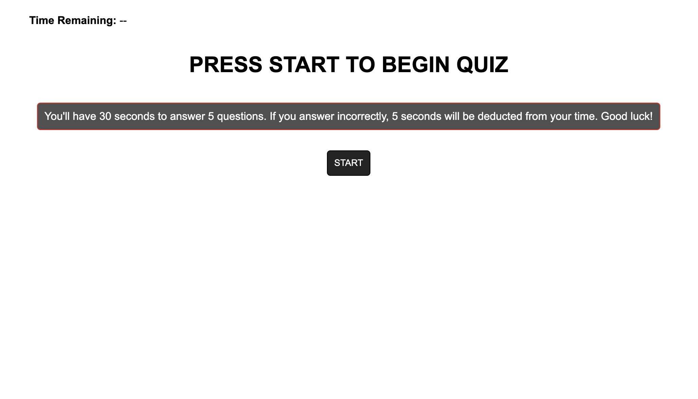

# Timed Quiz

Here's what the code does:

Index.html houses the main structure of the quiz
Style.css handles the styling
Script.js handles the logic for the quiz itself

The site uses a mix of flex / media queries to handle responsiveness.

When a User clicks "Start", a timer set for 30 seconds starts and they're asked a series of questions. If they choose correctly, their score goes up. If they choose incorrectly, their score does not go up. If they run out of time, the quiz ends. If they answer all questions the quiz ends. At the end, they can save their name/initials and score and retry the quiz if they want. Currently, the same questions will be asked.

View the site here: https://makeithappenmike.github.io/timed-quiz/

Contributions by Michael Martens

Screenshot:

 

 

 
